# 🚨 Cloud Security Capstone: Data Breach Response with BCDR Strategy

## 📌 Project Overview
This project demonstrates a real-world **cloud security incident response scenario** on Google Cloud Platform (GCP). It showcases a complete lifecycle from detection to remediation and disaster recovery, focusing on:
* **Securing Public-Facing Assets**
* **Vulnerability Containment**
* **Business Continuity (BC)**
* **Disaster Recovery (DR)**
* **Achieving Compliance (PCI DSS)**

## 🧠 Scenario
A production cloud environment suffered a **critical data breach** due to security misconfigurations. Publicly exposed storage buckets and a compromised virtual machine (VM) allowed malware activity and unauthorized access. As a Cloud Security Analyst, my responsibility was to contain the breach, remediate vulnerabilities, and restore operations with a robust BCDR strategy.

## 🎯 Objectives
* Use Security Command Center (SCC) to analyze security findings.
* Contain and eliminate compromised cloud resources.
* Implement a robust **BCDR (Business Continuity & Disaster Recovery)** plan.
* Secure storage buckets and network configurations (Firewall Hardening).
* Enforce Least Privilege Access and improve **PCI DSS compliance**.

## 🛠️ Tools & Technologies
* **Google Cloud Platform (GCP)**
* **Security Command Center (SCC)**
* **Compute Engine & Snapshots**
* **Cloud Storage**
* **VPC Firewall**
* **gcloud CLI**

---

## 📸 Visual Proof of Work & Implementation Gallery

This section documents the step-by-step implementation of the incident response and BCDR strategy.

### 1️⃣ Security Analysis & Findings
Analyze the GCP environment's initial state using Security Command Center to identify high-severity vulnerabilities.

* **SCC Dashboard & Risk Posture Overview:**
    Identified critical issues including publicly exposed storage buckets and insecure network configs.
    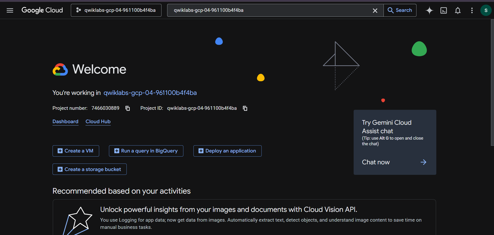
    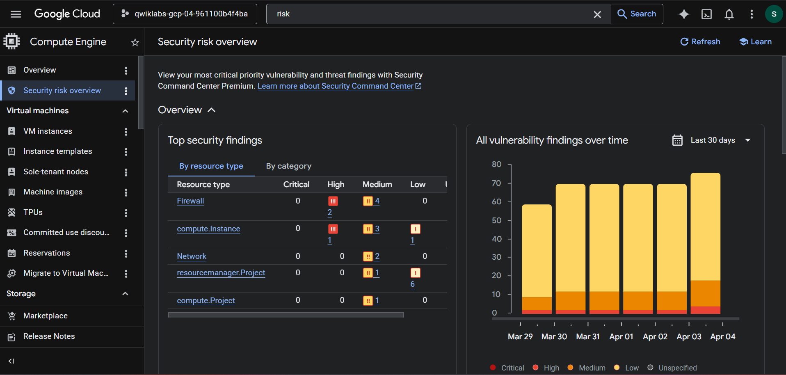

* **Compliance Posture Assessment (PCI DSS):**
    A detailed compliance scan revealed multiple violations of the PCI DSS standard before remediation.
    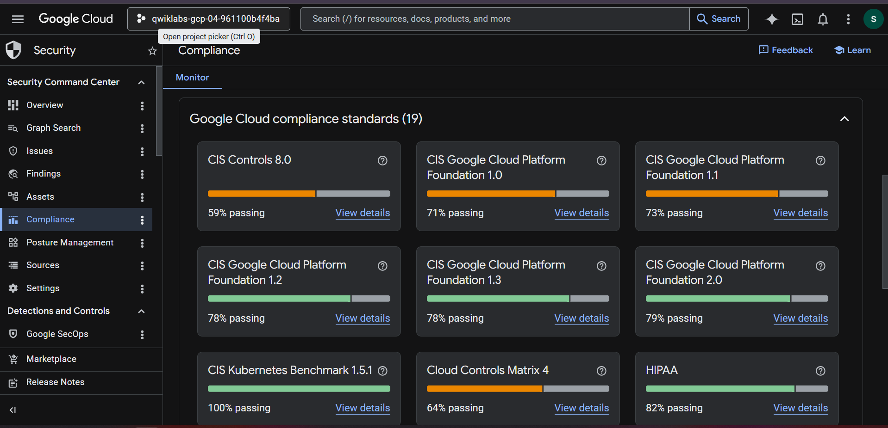
    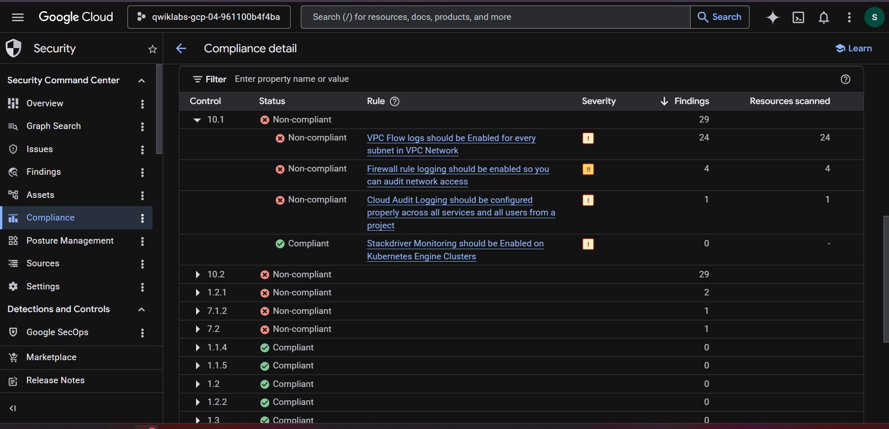

### 2️⃣ Remediation Phases

#### A. Storage Bucket Security Fix
Secure storage resources by disabling public access.

* **Identified Bucket Findings:**
    SCC flagged specific buckets with public access enabled.
    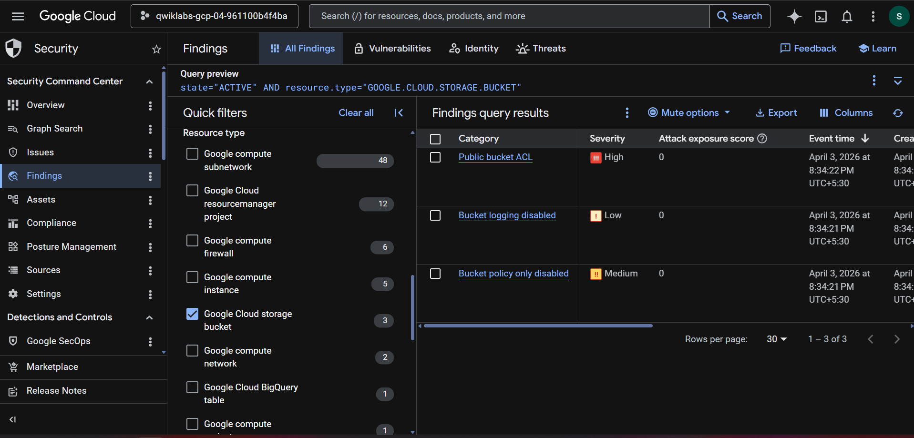

* *(Implementation: Public access disabled and uniform bucket-level access enforced).*

#### B. Compute Engine Remediation & BCDR Implementation
Contain the compromised VM, restore from backup, and verify the restored state.

* **Compromised VM Findings & Disaster Recovery:**
    SCC detected malware on `cc-app-01`. Compute Engine snapshots were used to restore from a known-good state. Compromised VM was destroyed.
    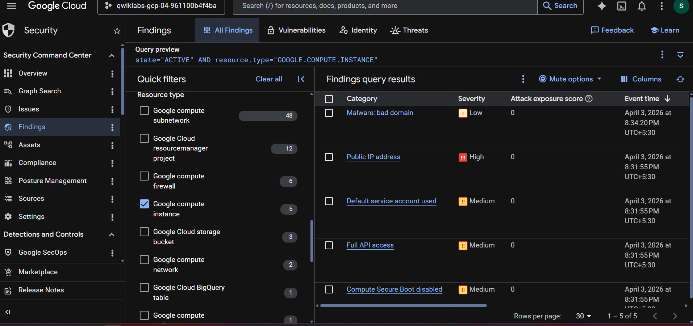
    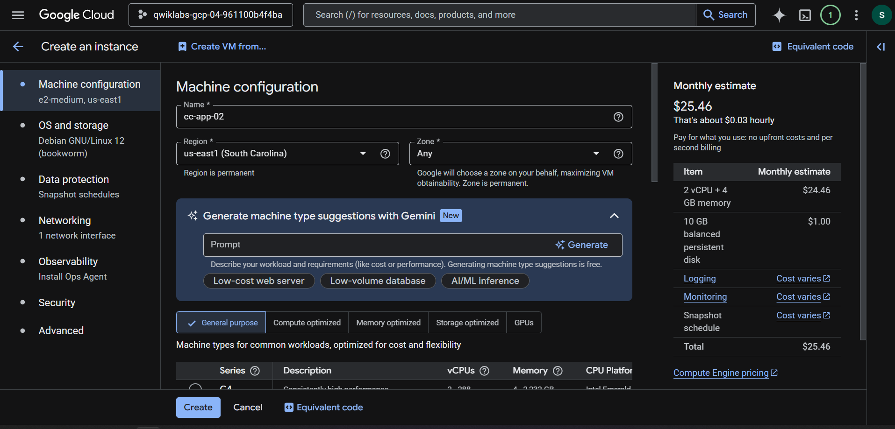
    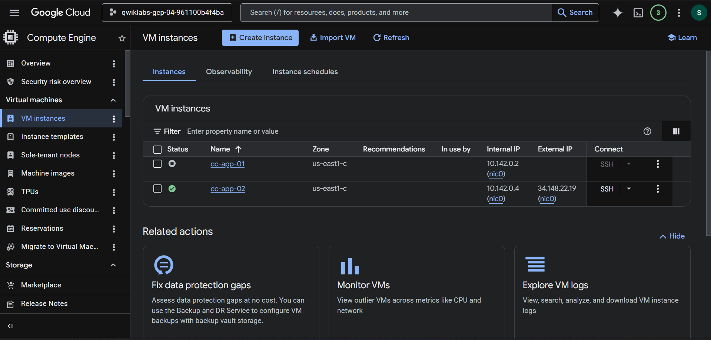

* **Verifying Business Continuity:**
    The new VM (`cc-app-02`) was verified to be running with restored data and secured configurations. Secure Boot was enforced.
    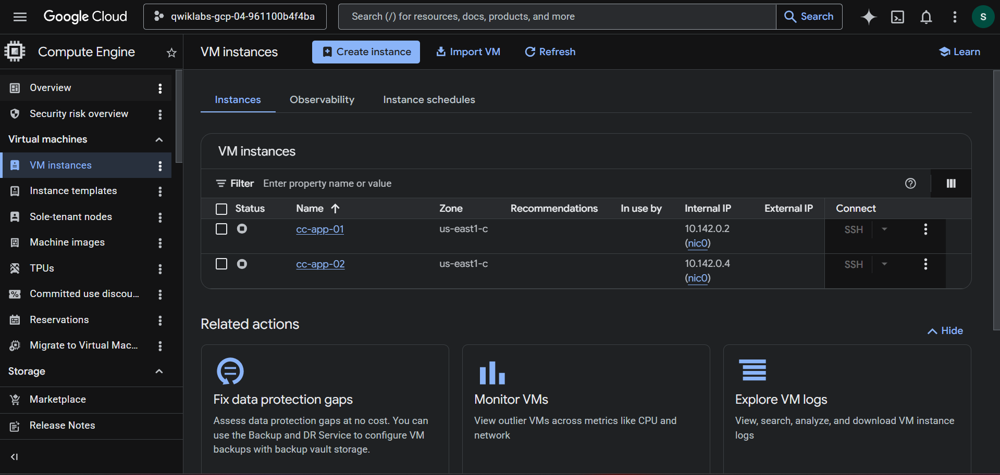
    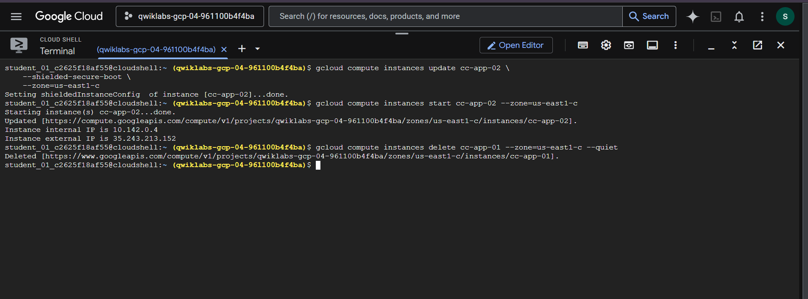

#### C. Firewall Hardening
Enforce network security by applying firewall rules that drop overly-permissive traffic.

* **Firewall Over-Permissive Rules Found:**
    SCC flagged VPC firewall rules that were too broad, increasing the attack surface.
    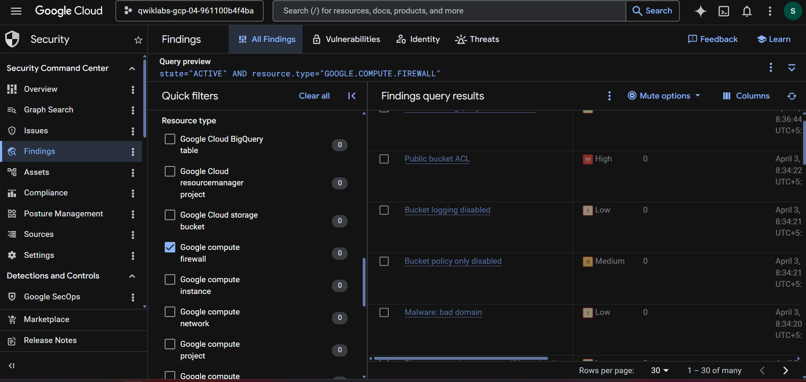

* **Applying and Verifying Rules:**
    Strict rules (e.g., IAP-only for SSH) were applied. Verification commands were executed.
    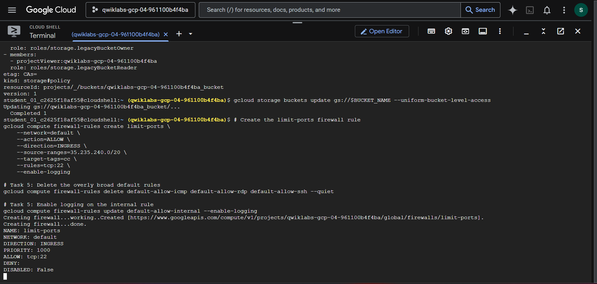
    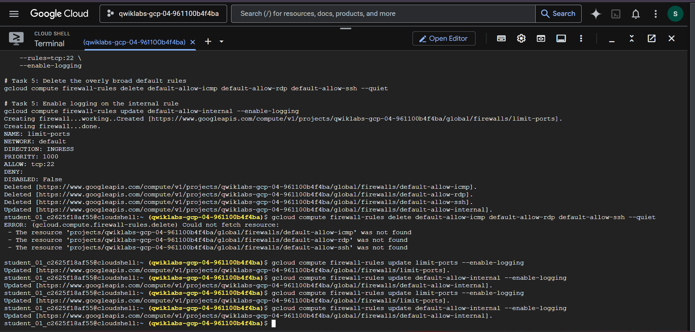

---

## 📜 Commands
All CLI commands used for identification, remediation, and BCDR execution are available here:
👉 **`Commands.sh`**

## 🔍 Key Security Fixes
| Issue | Fix Implemented |
| :--- | :--- |
| **Public Bucket** | Disabled public access; Enabled Uniform bucket-level access. |
| **Compromised VM** | Stopped/Destroyed VM; Restored safe VM from **Snapshots**. |
| **Public IP** | Removed public IP; Enabled Private Service Connect/IAP. |
| **Open Ports (SSH)** | Restricted access to IAP (Identity-Aware Proxy) only. |
| **Over-Permissioned SA** | Removed unnecessary roles and default Service Account. |

## ✅ Results
✔ **High Severity Findings Resolved**
✔ **Robust BCDR Plan Executed Successfully**
✔ **Secure Cloud Architecture Implemented**
✔ **Improved Compliance Posture (PCI DSS)**
✔ **Least Privilege Access Enforced**

## 💡 Key Learnings
* Practical, real-world Cloud Incident Response workflow.
* Critical importance of **Business Continuity & Disaster Recovery (BCDR)** strategies.
* Best practices for securing Google Cloud Platform resources (Compute, Storage, Network).
* Leveraging SCC for proactive risk assessment and monitoring.

## 🚀 Future Improvements
* Infrastructure as Code (Terraform) implementation.
* Automated security monitoring using Cloud Functions and SCC.
* Integration with a SIEM tool (e.g., Chronicle SIEM).

## 👨‍💻 Author
**Ayush Kumar Patel**
*Aspiring Cloud & Cyber Security Engineer 🚀* | *Focused on building secure, resilient cloud systems.*

## ⭐ Support
If you found this project useful, consider giving it a ⭐
